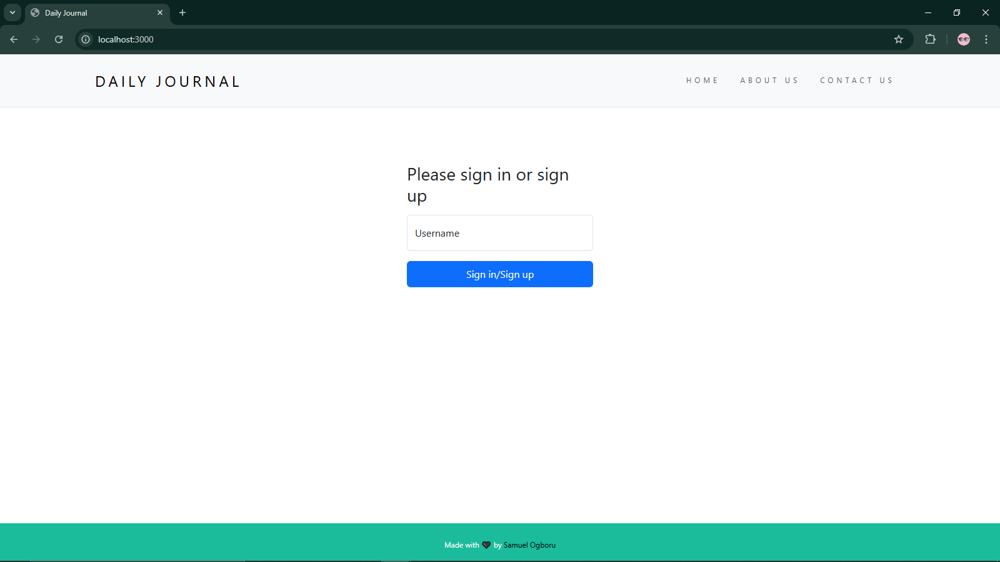

## Table of Contents

- [Overview](#overview)
  - [Screenshot](#screenshot)
  - [Links](#links)
- [My Process](#my-process)
  - [Built With](#built-with)
  - [What I Learned](#what-i-learned)
  - [Continued Development](#continued-development)
  - [Useful Resources](#useful-resources)
- [Author](#author)
- [Acknowledgments](#acknowledgments)

## Overview

Users should be able to:

- Sign up using just a username
- Sign in using your username
- Add a new post
- Edit the post
- Delete existing posts
- View each post in a new post 

### Screenshot

### Links

- Live Site URL: [Live Page](blog-post-production-eda6.up.railway.app)

## My Process

### Built With

- CSS custom properties
- Bootstrap
- Desktop-first workflow
- JavaScript
- EJS
- NodeJS/ExpressJS
- MongoDB/Mongoose

## Author

- Website - [Samuel Ogboru](https://portfolio-nine-gules-60.vercel.app/)
- Twitter - [@sammy_o_osaro](https://www.twitter.com/sammy_o_osaro)

